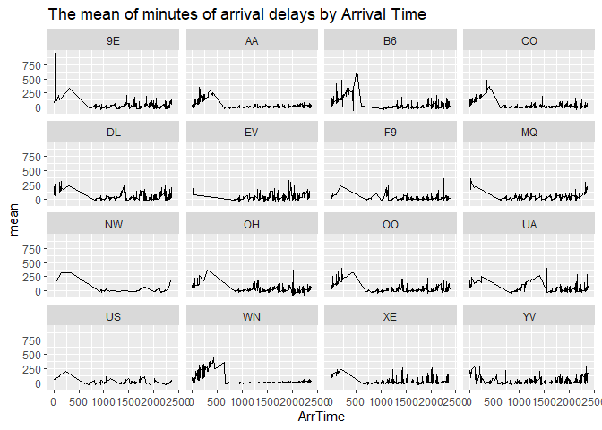
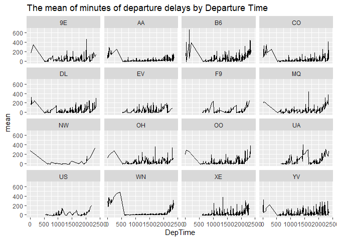
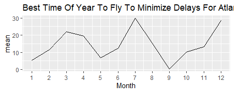
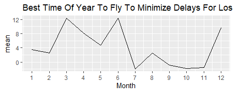

<!--   pdf_document: default
 md_document -->

## 1) Data visualization: flights at ABIA

### Question:

**What is the best month to fly to minimize arriving delays, and does
this change by airline?**

### Graph 1:

### Comment on Graph 1:

We can see from G1-1 of Graph 1 that the highest average of the arrival
delays by month is December, and that on September, October and November
are low compared to other months. Also, The G1-2 graph shows that the
month of the highest arrival delay is December, and that of the lowest
is May.

### Discussion on Graph 1:

So, from these results, we can estimate the following points. First, the
number of arrival delays probably is caused by the number of passengers
at ABIA. For example, a low number of arrival delays means fewer
passengers. Therefore, from September to November, the number of
passengers at ABIA might be lower than that of the other months. This is
because students in Austin start their semesters and do not use the
airport to go out of the city. In contrast, in December, the number of
passengers will increase drastically; for example, they fly to their
home countries and other cities in holidays.

Focusing on the max and min of the number, we can easily understand why
December has the highest number of arrival delays. However, we also need
to consider why we can see the lowest number in May. So, I provide one
of the reasons here: although airline companies offer a lot of airplanes
to prepare students to go out of cities after graduation or the end of
the semester, that did not happen by any reason.

### Graph 2:

<table>
<thead>
<tr class="header">
<th style="text-align: right;">Month</th>
<th style="text-align: left;">UniqueCarrier</th>
<th style="text-align: right;">mean</th>
</tr>
</thead>
<tbody>
<tr class="odd">
<td style="text-align: right;">12</td>
<td style="text-align: left;">XE</td>
<td style="text-align: right;">-1</td>
</tr>
<tr class="even">
<td style="text-align: right;">12</td>
<td style="text-align: left;">UA</td>
<td style="text-align: right;">4</td>
</tr>
<tr class="odd">
<td style="text-align: right;">12</td>
<td style="text-align: left;">AA</td>
<td style="text-align: right;">6</td>
</tr>
<tr class="even">
<td style="text-align: right;">12</td>
<td style="text-align: left;">US</td>
<td style="text-align: right;">6</td>
</tr>
<tr class="odd">
<td style="text-align: right;">12</td>
<td style="text-align: left;">YV</td>
<td style="text-align: right;">12</td>
</tr>
<tr class="even">
<td style="text-align: right;">12</td>
<td style="text-align: left;">WN</td>
<td style="text-align: right;">13</td>
</tr>
</tbody>
</table>

<table>
<thead>
<tr class="header">
<th style="text-align: right;">Month</th>
<th style="text-align: left;">UniqueCarrier</th>
<th style="text-align: right;">mean</th>
</tr>
</thead>
<tbody>
<tr class="odd">
<td style="text-align: right;">12</td>
<td style="text-align: left;">OH</td>
<td style="text-align: right;">41</td>
</tr>
<tr class="even">
<td style="text-align: right;">12</td>
<td style="text-align: left;">EV</td>
<td style="text-align: right;">26</td>
</tr>
<tr class="odd">
<td style="text-align: right;">12</td>
<td style="text-align: left;">OO</td>
<td style="text-align: right;">22</td>
</tr>
<tr class="even">
<td style="text-align: right;">12</td>
<td style="text-align: left;">B6</td>
<td style="text-align: right;">19</td>
</tr>
<tr class="odd">
<td style="text-align: right;">12</td>
<td style="text-align: left;">CO</td>
<td style="text-align: right;">17</td>
</tr>
<tr class="even">
<td style="text-align: right;">12</td>
<td style="text-align: left;">DL</td>
<td style="text-align: right;">16</td>
</tr>
</tbody>
</table>

This data includes 15 airline companies, which are Endeavor Air(9E),
American Airlines(AA), JetBlue(B6), Continental Airlines(CO), Delta Air
Lines(DL), ExpressJet(EV), Frontier Airlines(F9), American Eagle
Airlines(MQ), Northwest Airlines(NW), PSA Airlines(OH), SkyWest
Airlines(OO), United Airlines(UA), US Airways(US), Southwest
Airlines(WN), JSX(XE), Mesa Airlines(YV).

It is difficult for us to see the number of arriving delays all month to
judge which airline is the best. So ,here, I focus on that of December
because the number of arriving delays is highest on December.

### Comment on Graph 2 and Tables:

The Graph 2 shows that the number of arriving delays by months and
airlines. The first table says its data by ascending order and the
second table do it by decending order.

The fluctiation of most of airlines looks like that of the average one
except for some companies, such as EV and DL. The companies with low
delays on Decemberare JSX, United Airline and American Airline, and the
companies with high delays on Decemberare PSA Airline, Express Jet and
SkyWest Airlines.

### Discussion on Graph 2:

United Airlines and American Airlines are very famous and big companies
with many planes and flight paths. So if some of the airplanes they have
were delayed, they might have another way to avoid delays more than
small companies. So, therefore, big firms were better if you wanted to
avoid the uncertainty of arrival delays of your air in December.

### Conclusion:

If you want to avoid arrival delays of your air, especially in December
when many delays happen, you should choose big firms like United
Airlines and American Airlines.

## 2) Wrangling the Olympics

### A) What is the 95th percentile of heights for female competitors across all Athletics events?

    ## 95% 
    ## 183

From the result, the answer is **183**

### B) Which single women’s event had the greatest variability in competitor’s heights across the entire history of the Olympics, as measured by the standard deviation?

<table>
<thead>
<tr class="header">
<th style="text-align: left;">event</th>
<th style="text-align: right;">sd</th>
<th style="text-align: left;">sex</th>
</tr>
</thead>
<tbody>
<tr class="odd">
<td style="text-align: left;">Rowing Women’s Coxed Fours</td>
<td style="text-align: right;">10.865490</td>
<td style="text-align: left;">F</td>
</tr>
<tr class="even">
<td style="text-align: left;">Basketball Women’s Basketball</td>
<td style="text-align: right;">9.700255</td>
<td style="text-align: left;">F</td>
</tr>
<tr class="odd">
<td style="text-align: left;">Rowing Women’s Coxed Quadruple Sculls</td>
<td style="text-align: right;">9.246396</td>
<td style="text-align: left;">F</td>
</tr>
<tr class="even">
<td style="text-align: left;">Rowing Women’s Coxed Eights</td>
<td style="text-align: right;">8.741931</td>
<td style="text-align: left;">F</td>
</tr>
<tr class="odd">
<td style="text-align: left;">Swimming Women’s 100 metres Butterfly</td>
<td style="text-align: right;">8.134398</td>
<td style="text-align: left;">F</td>
</tr>
<tr class="even">
<td style="text-align: left;">Volleyball Women’s Volleyball</td>
<td style="text-align: right;">8.101521</td>
<td style="text-align: left;">F</td>
</tr>
</tbody>
</table>

Therefore, the answer is **Rowing Women’s Coxed Fours**.

### c) How has the average age of Olympic swimmers changed over time? Does the trend look different for male swimmers relative to female swimmers?

From the above graph, the average age of Olympic swimmers has increased
over time after 1925 for both males and females. The difference in the
average age between males and females looks narrow recently compared to
the past.

## 3) K-nearest neighbors: cars

### Steps

We did this following steps to analyze K-nearest neighbors

-   1.  Made two dataset for each trim of 350 and 65 AMG

&lt;Run 10 times&gt; - 2. Split the data into a training and a testing
set with probability of 0.8 by each trim. - 3. Set K-nearest-neighbors
with 2-100 values of K. - 4. For each value of K, Run regression of
knnreg and fit the model training set to calculate the out-of-sample
root mean-squared error (RMSE) for each value of K by each trim.
<up to this>

-   1.  From the 10 times average of RMSE, we get the optimal value of K
        by each trim

-   1.  we predict the model with the optimal K.

### Results of Step 2-5

From the result of these graphs, we can see that the optimal K of the
350 is 60, and the optimal K of the 63 AMG is 18.

### Result of 6: The fitted model of the 350

The plot of the fitted model of the 350 k = 60 is the following.

### Result of 6: The fitted model of the 63 AMG

The plot of the fitted model of the 350 at k = 18 is the following.

### Which trim yields a larger optimal value of K? Why do you think this is?

The optimal value of k of 350 is larger than that of 63 AMG. This is
because…
